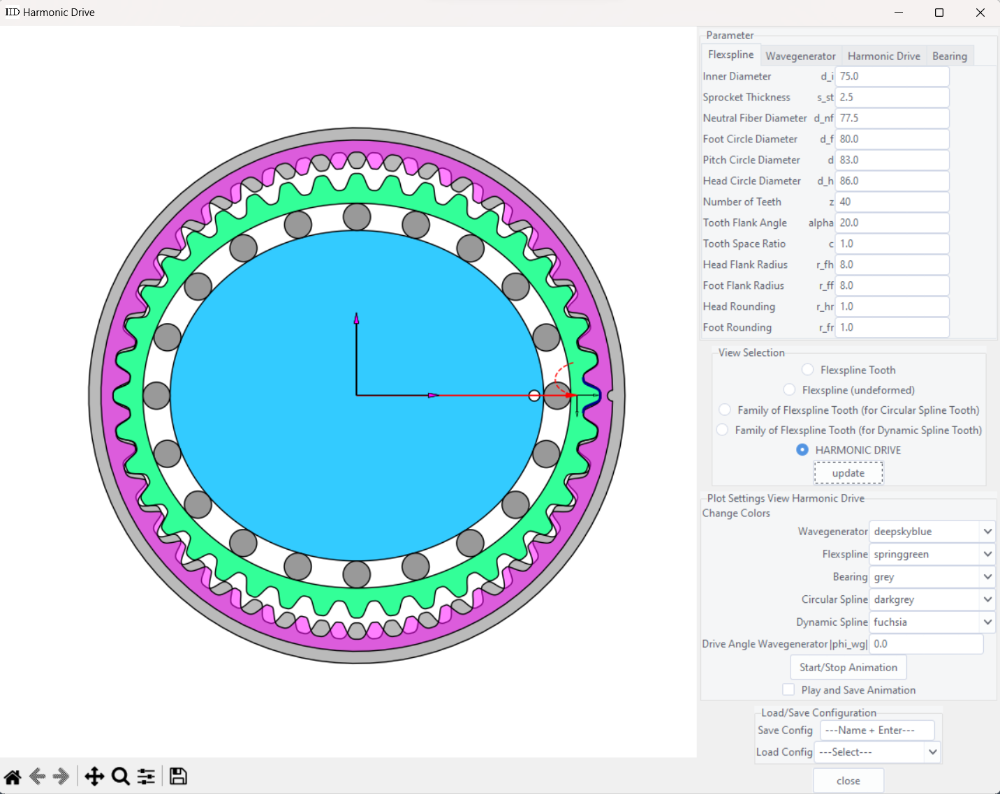

# Harmonic Drive

Generates the profile of the wave generator as well as the toothings of the circular and dynamic spline for a given flexspline with toothing.
The code can be used to create an animation of the harmonic drive (e.g. see animation_result.mp4)

### Dependencies

Used packages:

numpy, scipy, shapely, matplotlib, tqdm

## Author

Simeon Wolf
[ LinkedIn](https://www.linkedin.com/in/simeon-w-8a1445228/)

## License

This project is licensed under the MIT License - see the LICENSE file for details
